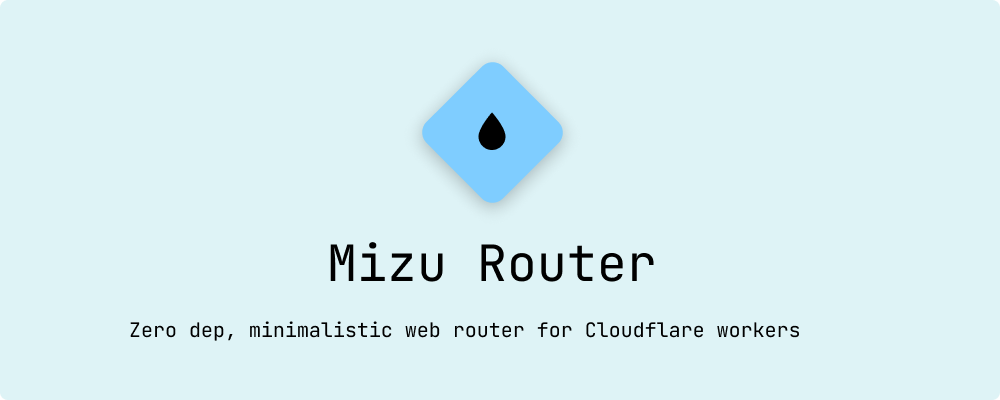

[](https://www.npmjs.com/package/mizu-router)

# Mizu Router

<p align="center"> <b>Mizu Router</b> is a zero-depency, minimalistic web router for Cloudflare Workers! </p>

## 🤔 Why Mizu Router?

Mizu Router is inspired by [Hono](https://hono.dev) and boasts the following features:

1. 🏎️ **Extremely Fast**: Trie Based routing allows Mizu to scale and perform lookups very instantly
2. 0️⃣ **Zero dependencies**: Natively written in typescript and uses standard web APIs
3. 🐤 **Minimalistic and Small**: Less than 1.0K when gzipped!
4. 🌏 **Supports Global store**: instantiate global objects and pass it to all routes!
5. 🤨 **Supports automated query parsing**: Automated query parsing!
6. 🚏 **Supports dynamic routing**: `/users/:id` - id is available via `ctx.params`
7. 🔁 **Supports subrouting**: attach multiple routers expressJS style! (see example below)
8. ⭐️ **Supports wildcard routes**: handle wildcard routes! (see example below)

> I built this router for fun, as Hono doesn't support global stores and some cool features.

## ⚡️ Quickstart

```ts
import { Router } from "mizu-router";

// 1. Define Env interface for Cloudflare bindings
interface Env {
 SECRET: string;
}

// 2. Define Store interface for global state
interface Store {
 localSecret: string;
}

// Create router with Env and Store types
const router = new Router<Env, Store>();

// 3. Global middleware that initializes store
router.use(async (ctx, next) => {
 // Initialize store with request count
 ctx.store = { localSecret: "hello world - inital store" };
 return next();
});

router.get("/", async (ctx) => {
 // store will be initial value
 return new Response(JSON.stringify({
  secret: ctx.env.SECRET,
  store: ctx.store.localSecret,
 }));
});

// 4. Global middleware that increments request count
router.use(async (ctx, next) => {
 // updating global store
 ctx.store.localSecret = "updated store";
 return next();
});

router.get("/updated", async (ctx) => {
 // store will be updated value
 return new Response(JSON.stringify({
  secret: ctx.env.SECRET,
  store: ctx.store.localSecret,
 }));
});

// Create a subrouter
const userRouter = new Router<Env, Store>();

// 5. Route with dynamic parameter
userRouter.get("/:id", async (ctx) => {
 // Access dynamic parameter
 const userId = ctx.params.id;
 
 // Access query parameters
 const format = ctx.query.format || "json";
 
 return new Response(JSON.stringify({
  userId,
  secret: ctx.env.SECRET,
  localSecret: ctx.store.localSecret,
  format
 }));
});

// 6. Mount subrouter
router.route("/users", userRouter);

// 7. Add wildcard route
router.get("/wildcard/*", async (ctx) => {
 return new Response(JSON.stringify({
  message: "wildcard route",
  path: ctx.params
 }));
});

export default {
 async fetch(request: Request, env: Env, ctx: ExecutionContext): Promise<Response> {
  return router.handle(request, env, {} as Store);
 },
} satisfies ExportedHandler<Env>;

```

## ⬇️ Installation

1. Initalise Cloudflare worker project via wrangler

```bash
pnpm dlx wrangler init
```

2. Add `mizu-router` as dependency

```bash
pnpm add mizu-router
```

## 🤝 Contributions

- Feel Free to Open a PR/Issue for any feature or bug(s).
- Make sure you follow the [community guidelines](https://docs.github.com/en/github/site-policy/github-community-guidelines).
- Feel free to open an issue to ask a question/discuss anything about mizu-router.
- Have a feature request? Open an Issue!
- Please ensure to run `pnpm test` before submitting your PRs!

## ⚖ License

Copyright 2025 Hemanth Krishna

Licensed under MIT License : <https://opensource.org/licenses/MIT>

<p align="center">Made with ❤ , single can of redbull</p>
